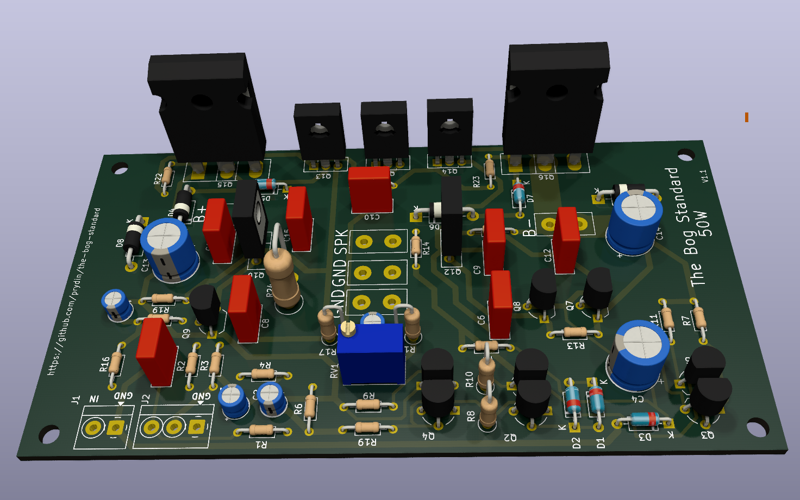

# The Bog Standard - A common sense 50W amplifier for the common (wo)man.

## Background
The idea of this amplifier came from me seeing beginners struggling with amplifier designs 
that were either pure junk, too complicated, required exotic and obsolete components or all of the above.
This sparked a very interesting conversation on diyaudio.com where I presented a previous design
as a candidate. Over the next few weeks, that design got thoroughly critiqued and reworked several times.
As the keen reader will see, the design eventually gravitated towards an architecture that closely
resembles Douglas Self's famous "Blameless Amplifier" concept, albeit using MOSFET output devices rather
than BJTs. 

## Design goals
I had a few overall requirements of the design:
1. Respectable HiFi-grade performance
2. Using only basic, readily available components
3. Being forgiving with respect to component matching
4. No complicated cooling or power supplies needed
5. Being simple enough that someone with modest electronics knowledge can understand its operating principles.

## Component choices
I went with MOSFET output devices because I like the way they sound and they're easy to work with. While
some people suggested rare and expensive lateral MOSFETs, in the spirit of the project, I went with the
good old IRFP(9)240. Based on measurements and listening tests, they perform very well in this setup.

The rest of the transistors are, well, bog standard: 2N5551/2N5401 for low power and BD139/140 for 
medium power. That's it. The rest are just passives and basic diodes.

## Design highlights
As mentioned above, the design follows Doug Self's Blameless Amplifier relatively closely. I went with 
a fairly high loop gain to make sure I had enough to smooth out any non-linearities in the MOSFETs. But
even with all that gain, the amplifier is stable with a 47pF Cdom (and probably 33pF as well, but I was 
out of that value when I tested it). SPICE simulations show about 90 degrees of phase margin with 33pF.

The rest is, you guessed it, Bog Standard. A long-tailed pair differential amplifier at the input section,
a simple single-ended VAS, BJT drivers and MOSFET outputs. The input section and VAS are driven by constant
current sources and the LTP is loaded using a current mirror. The current through the LTP is about 1mA and 
the VAS runs on about 13mA. Q15 offers some basic SOA protection of the VAS. 

The quiescent current is regulated using a standard VBE multiplier controlled by a simple voltage divider.
The design calls for the VBE transistor to be thermally connected to the output devices, by means of 
mounting them on the same heat sink. This gives the amplifier a negative temperature coefficient. 

## Quiescent current setting
I am tentatively running the amplifier on 100mA of quiescent current. This results in an overall power draw
of slighly more than 3W, which seems like a reasonable compromise. Increasing the bias above this didn't 
seem to have any meaningful impact on distortion.

It is very important to let the amplifier warm up before fine tuning the bias. With the VBE multiplier
mounted close to the drivers and outputs, the bias current will have a pronounced negative temperature 
coefficient, so you should expect the quiescent current to be higher on a cold amplifier and then settle.

## Power supply and grounding
The very simple unregulated power supply that's part of this repository seems to work well and is desined
along the principle of simplicity rather than sophistication. The amplifier itself should have a decent Power
Supply Rejection Ratio (PSRR).

In my build, all grounds (signal, earth and power) meet at the DC side of the power supply and the PCB layout provides
connectors for tying the grounds together. In preliminary tests, there was no audible hum or noise. 

## Transformer
I recommend a 160VA/2x25V toroidial transformer. The actual secondary voltage will vary depending on your mains
voltage, but where I live I get about 35V DC on each rail after rectification. This results in clipping at about
65W in my case. 

## Case and hardware
The PCBs are compact, so you have a lot of freedom in terms of your physical build. I went for a compact
case from NobSound. It made wire routing a bit challenging and I had to make some compromises. However, the
build came out great without any audible hum or noise. 

### Heat sinks
I'm using a pair of 100 x 40 x 20mm finned heatsinks I found on Amazon. They work well up to about 40W but
get very hot at 50W and above. If your case allows it, I would recommend slightly larger sinks. This is one 
of those situations where bigger really IS better!

## Preliminary performance metrics
* THD @ 1W/1kHz: <0.005%
* Bandwidth (3dB): 20Hz - 900kHz
* Slew rate: 27V/us
* Calculated phase margin: 89 degrees

## Schematic
Click image to enlarge!

## Gerber files
* Amplifier: [kicad/gerber](kicad/gerber)
* Power supply: [kicad/power_supply/gerber](kicad/power_supply/gerber)

## Image gallery

## About me
I was born in Sweden but live in the US since many years. A software engineer by trade, but I grew up in a home 
full of electronics and test equipment. My father was a very accomplished designer or RF amplifiers for cell towers, so amplifiers 
run in my blood. We had countless conversations over the dinner table about amplifier design. Unfortunately, 
he's no longer with us, but I know he would have loved to follow this project and probably had been very 
opionionated about my design choices...

## Acknowledgements and credits
This work rests on the shoulders of giants. Much of the design is borrowed from Douglas Self's legendary
book "Audio Power Amplifier Design". This is a must-read for anyone interested in audio electronics!
A heartfelt thank you also goes out to the friendly and extremely knowledgeable community at diyaudio.com.
If you haven't joined that site, you should! 

